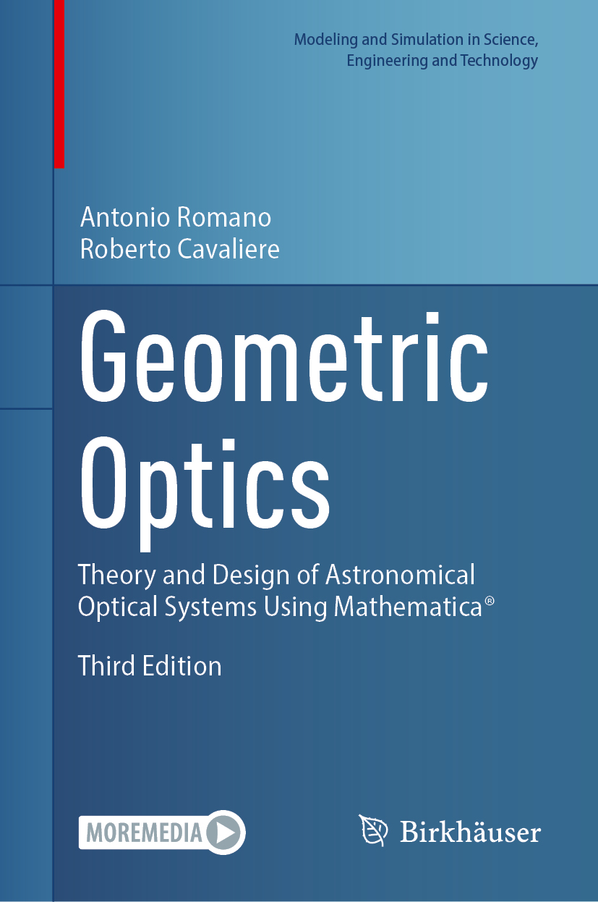

# Geometric Optics: Theory and Design of Astronomical Optical Systems Using Mathematica®
This repository accompanies the book [*Geometric Optics: Theory and Design of Astronomical Optical Systems Using Mathematica®*](https://link.springer.com/book/9783032439505) by  Antonio Romano and Roberto Cavaliere (Birkhäuser, 2027).

